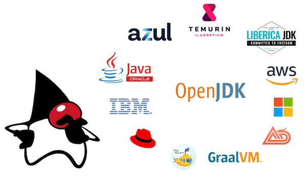

# Which Version of JDK Should I Use?



To build and run Java applications, a Java Compiler, Java Runtime Libraries, and a Virtual Machine are required that implement the Java Platform, Standard Edition ("Java SE") specification.

The [OpenJDK](https://openjdk.java.net) is the open source reference implementation of the Java SE Specification, but it is only the source code.
Binary distributions are provided by different vendors for a number of supported platforms.
These distributions differ in licenses, commercial support, supported platforms, and update frequency.

This site gives independent, yet opinionated recommendations.


## TL;DR

✅ Recommendation: Use [Adoptium Eclipse Temurin 17](#adoptium-eclipse-temurin) and ensure that your local version matches the CI and production version.  
Make sure, you have the latest patch level 17.0.3 or later, due to [CVE-2022-21449](https://neilmadden.blog/2022/04/19/psychic-signatures-in-java/).

## Releases

Under the current [JDK release model](https://openjdk.java.net/projects/jdk/), a new feature release with a new major version number is planned every six months, in March and September. Additionally, there are quarterly bug fix updates.

Every three years, the September release will be a Long-Term-Support (LTS) release, which gets updates for at least three years.


| JDK Version	                                        | Type    | Release Date | Highlights         | Recommendation                                                                                                                                                                                                                      |
|-----------------------------------------------------|---------|--------------|--------------------|-------------------------------------------------------------------------------------------------------------------------------------------------------------------------------------------------------------------------------------|
| [**8**](https://openjdk.java.net/projects/jdk8/)    | **LTS** | **03/2014**  | Lambdas            | Last LTS version under previous release model. Free updates by Oracle [ended](https://www.oracle.com/java/technologies/java-se-support-roadmap.html), but still maintained by others. Upgrade to a 11 or 17 within the next months! |
| [9](https://openjdk.java.net/projects/jdk9/)        | Feature | 09/2017	     | Modules            | New release model was introduced. EOL. Upgrade to 11 or 17 now!                                                                                                                                                                     |
| [10](https://openjdk.java.net/projects/jdk/10/)     | Feature | 03/2018	     | var                | EOL. Upgrade to 11 or 17 now!                                                                                                                                                                                                       |
| [**11**](https://openjdk.java.net/projects/jdk/11/) | **LTS** | **09/2018**	 | New HTTP Client    | Widely used LTS version. Plan upgrade to version 17 within the next months.                                                                                                                                                         |
| [12](https://openjdk.java.net/projects/jdk/12/)     | Feature | 03/2019	     |                    | EOL. Upgrade to 17 now!                                                                                                                                                                                                             |
| [13](https://openjdk.java.net/projects/jdk/13/)     | Feature | 09/2019	     |                    | EOL. Upgrade to 17 now!                                                                                                                                                                                                             |
| [14](https://openjdk.java.net/projects/jdk/14/)     | Feature | 03/2020	     | Switch expressions | EOL. Upgrade to 17 now!                                                                                                                                                                                                             |
| [15](https://openjdk.java.net/projects/jdk/15/)     | Feature | 09/2020	     | Text blocks        | EOL. Upgrade to 17 now!                                                                                                                                                                                                             |
| [16](https://openjdk.java.net/projects/jdk/16/)     | Feature | 03/2021	     | Records            | EOL. Upgrade to 17 now!                                                                                                                                                                                                             |
| [**17**](https://openjdk.java.net/projects/jdk/17/) | **LTS** | **09/2021**	 | Sealed Classes     | Current LTS version. [Update to 17.0.3+ now!](https://neilmadden.blog/2022/04/19/psychic-signatures-in-java/)                                                                                                                                                                                                               |
| [18](https://openjdk.java.net/projects/jdk/18/)     | Feature | 03/2022	     | [UTF-8 by Default](https://openjdk.java.net/jeps/400)   | Stick to 17!<br>It is a short term release without  significant features. You might want to check if you run in any issues with "UTF-8 by Default" by setting `-Dfile.encoding=UTF-8` in your current JDK.                                                                                                                                                            |
| [19](https://openjdk.java.net/projects/jdk/19/)     | Feature | 09/2022	     | Preview and incubator features, only                   | Stick to 17!<br>If you upgraded to 18 before, upgrade now to 19.                                                                                                                                                            |

You have to decide if you want to stick with the latest LTS version, or if you go with the latest feature release and upgrade every six months.
Both options are okay, but if you're uncertain, stick with the latest LTS version.

The OpenJDK project itself is managed on [openjdk.java.net](https://openjdk.java.net) where you can find specifications, source code, and mailing lists, but there are no builds that you can download.
You need to choose a distribution.

## Distributions

- [OpenJDK builds by Oracle (jdk.java.net)](#openjdk-builds-by-oracle-jdkjavanet)
- [Oracle Java SE Development Kit (JDK)](#oracle-java-se-development-kit-jdk)
- [Adoptium Eclipse Temurin](#adoptium-eclipse-temurin)
- [AdoptOpenJDK](#adoptopenjdk)
- [Azul Zulu](#azul-zulu)
- [Azul Zing](#azul-zing)
- [BellSoft Liberica JDK](#bellsoft-liberica-jdk)
- [IBM Semeru Runtime](#ibm-semeru-runtime)
- [Amazon Corretto](#amazon-corretto)
- [Microsoft Build of OpenJDK](#microsoft-build-of-openjdk)
- [Alibaba Dragonwell](#alibaba-dragonwell)
- [SapMachine](#sapmachine)
- [Red Hat OpenJDK](#red-hat-openjdk)
- [GraalVM](#graalvm)


### OpenJDK builds by Oracle (jdk.java.net)

[Website](https://jdk.java.net) |
[Releases](https://jdk.java.net) |
Docker Images (n/a)

Oracle provides OpenJDK builds for Linux, macOS and windows in a compressed archive format.

These builds will only be updated for a 6-month period. 
Updates and security patches will not be available after this short period. 
This also applies for LTS versions! 
e.g., the latest OpenJDK 11 build was [11.0.2+9](https://jdk.java.net/archive/) while the current OpenJDK version is [11.0.12+7](https://wiki.openjdk.java.net/display/JDKUpdates/JDK11u).

⛔️ Recommendation: Do not use _OpenJDK builds by Oracle_, particularly if you plan to stick with LTS versions.


### Oracle Java SE Development Kit (JDK)

[Website](https://www.oracle.com/java/) |
[Releases](https://www.oracle.com/java/technologies/downloads/archive/) |
Docker Images (n/a)

Oracle provides a commercial version of the OpenJDK, which are based on the exactly same sources of the OpenJDK: The Oracle Java SE Development Kit (JDK).
Oracle provides updates regular updates and security patches for these builds.

The main issue with these builds is Oracle's licensing policy:

Until version 10, builds were published under the [Oracle Binary Code License Agreement](https://www.oracle.com/de/downloads/licenses/binary-code-license.html), which effectivly allowed the builds to be used for commercial projects.

With version 11 to version 16 builds were published under the [Oracle Technology Network License Agreement for Oracle Java SE](https://www.oracle.com/downloads/licenses/javase-license1.html), **which require a fee-based license for usage in production**.
This is why many new distributions of the OpenJDK have emerged.

Version 17 is published under the [Oracle No-Fee Terms and Conditions (NFTC)](https://www.oracle.com/downloads/licenses/no-fee-license.html), which allows the usage of the builds for running _internal business operations_. Unfortunately, the phrase "internal business operations," is not defined and is a very vague phrase (e.g. is a public-facing website running internal business operations?).

Also, based on this volatile licensing history, it is not predictable, how future version will be licensed.

⛔️ Recommendation: Do not use _Oracle Java SE Development Kit (JDK)_ before consulting your lawyer.


### Adoptium Eclipse Temurin

[Website](https://adoptium.net) |
[Releases](https://adoptium.net/archive.html) |
[Docker Images](https://hub.docker.com/_/eclipse-temurin/)

Eclipse Adoptium is a top-level project under the Eclipse Foundation, which provides resources and a professional governance model for open source software.
The Adoptium Working Group consists of major companies and organizations that have a strategic interest in the Java technology, including Red Hat, IBM, Microsoft, Azul, and the iJUG. The former AdoptOpenJDK project has moved to Eclipse Adoptium.

The Adoptium OpenJDK builds are called _Eclipse Temurin_ to distinguish the project from the builds. 

Eclipse Temurin builds are high-quality, vendor-neutral, and TCK-tested under a permissive license.

Adoptium states, it will continue to build binaries for LTS releases as long as the corresponding upstream source is actively maintained.

✅ Recommendation: _Adoptium Eclipse Temurin_ OpenJDK builds are highly recommended.


### AdoptOpenJDK

[Website](https://adoptopenjdk.net) |
[Releases](https://adoptopenjdk.net/archive.html?variant=openjdk11&jvmVariant=hotspot) |
[Docker Images](https://hub.docker.com/_/adoptopenjdk)

The AdoptOpenJDK project was the predecessor of Eclipse Adoptium and provided high-quality OpenJDK builds, both for the default HotSpot and the OpenJ9 virtual machine.

The website and older releases are kept online to access archived releases.

⛔️ Recommendation: Do not use _AdoptOpenJDK_ anymore. Use _Adoptium Eclipse Temurin_ instead.


### Azul Zulu

[Website](https://www.azul.com) |
[Releases](https://www.azul.com/downloads/?package=jdk#download-openjdk) |
[Docker Images](https://hub.docker.com/r/azul/zulu-openjdk)

Azul Systems, Inc., has specialized in professional Java technologies and commercial support for JDK.
Azul has a high-industry reputation and is engaged in various working groups to evolve the Java platform.

Azul provides open source OpenJDK builds called _Azul Zulu_ for many operating systems and architectures.
Additionally, Azul provides builds for special requirements, such as stripped down JREs and builds including OpenJFX.

A downside of these builds is the dependency to a single company, that may suddenly change its license or update policies.

✅ Recommendation: _Azul Zulu Builds of OpenJDK_ are a good choice.


### Azul Zing

[Website](https://www.azul.com) |
[Releases](https://www.azul.com/products/prime/stream-download/) |
Docker Images (n/a)

Azul Zing is a commercial JDK, currently marketed as _Azul Platform Prime_. 
It requires a commercial contract with Azul Systems for production use.

Zing is OpenJDK-based, and adds the patented "C4 Pauseless Garbage Collector", the "Falcon JIT Compiler" (that optimizes for throughput at the cost of higher CPU usage and longer start-up and warm-up times), and some features to speed up compiler warm-up time (to mitigate the Falcon JIT Compiler's slower warm-up times by profiling and storing optimizations of training runs in files).

Azul Zing has some use cases in financial trading applications, where GC pauses are a problem.
Apart from that, the regular OpenJDK contains the free low-pause time GCs [Shenandoah](https://wiki.openjdk.java.net/display/shenandoah/Main) and [ZGC](https://wiki.openjdk.java.net/display/zgc) that may be an alternative.

⚠️ Recommendation: Consider _Azul Zing / Azul Platform Prime_ when GC pause times are a problem. Do not use it in production without a license.


### BellSoft Liberica JDK

[Website](https://bell-sw.com) |
[Releases](https://bell-sw.com/pages/downloads/?) |
[Docker Images](https://hub.docker.com/u/bellsoft)

Similar to Azul, BellSoft has specialized in professional Java technologies and commercial support for JDK.
Also, BellSoft has a high industry reputation and is engaged in various working groups to evolve the Java platform.

BellSoft provides open source OpenJDK builds called _Liberica JDK_ for pretty much all operating systems and architectures.

The popular Spring Boot framework chose Liberica JDK as runtime for their [buildpack](https://github.com/paketo-buildpacks/bellsoft-liberica).

A downside of these builds is the dependency to a single company, that may suddenly change its license or update policies.

✅ Recommendation: _BellSoft Liberica JDK_ builds are a good choice.


### IBM Semeru Runtime

[Website](https://developer.ibm.com/languages/java/semeru-runtimes/) |
[Releases](https://developer.ibm.com/languages/java/semeru-runtimes/downloads/) |
Docker Images (n/a)

IBM developed its own version of the Java Virtual Machine, called J9 and it was open-sourced as _Eclipse OpenJ9_.
It is an alternative to the default HotSpot Java Virtual Machine, but it has never gained much popularity.

IBM now provides builds called _Semeru Runtime_ based on the Eclipse OpenJ9 Java Virtual Machine and some OpenJDK class libraries.
OpenJ9 has a [low memory footprint and starts fast with shared classes](https://www.eclipse.org/openj9/performance/), but lower throughput compared to Hotspot Virtual Machine.

⛔️ Recommendation: Use _IBM Semeru Runtime_ only if you know that you need the OpenJ9 Virtual Machine.


### Amazon Corretto

[Website](https://aws.amazon.com/de/corretto/) |
[Releases](https://aws.amazon.com/de/corretto/) |
[Docker Images](https://hub.docker.com/_/amazoncorretto)

Since Oracle changed the support and license policy for its OpenJDK builds, major cloud providers decided to establish their own managed OpenJDK builds and providing long-term updates. Apparantly, this is to avoid risks, especially lawsuits against Oracle.

In 2018, AWS published _Corretto_, yet another OpenJDK build.

AWS includes back ports of bug fixes from newer OpenJDK versions and [claims](https://aws.amazon.com/corretto/faqs/) that they would add patches that might not yet be integrated in the OpenJDK project. Amazon has implemented an alternative [crypto provider](https://github.com/corretto/amazon-corretto-crypto-provider) that has been optimized for their services. It is [planned](https://aws.amazon.com/blogs/opensource/introducing-amazon-corretto-crypto-provider-accp/) to be used as the default crypto implementation in Corretto.

Amazon provides releases for major development platforms and an optimized version for its own Amazon Linux 2.

✅ Recommendation: _Corretto_ builds are a good choice, particularly if you run Java applications directly on Amazon Linux 2 in AWS.


### Microsoft Build of OpenJDK

[Website](https://www.microsoft.com/openjdk) |
[Releases](https://docs.microsoft.com/en-us/java/openjdk/download) |
[Docker Images](https://docs.microsoft.com/en-us/java/openjdk/containers)

In 2021, Microsoft published _Microsoft Build of OpenJDK_, yet another OpenJDK build.

Microsoft may include back ports of bug fixes from newer OpenJDK versions and claims that they would add patches that might not yet be integrated in the OpenJDK project.

Microsoft provides releases for major development platforms.

⚠️ Recommendation: Use _Microsoft Build of OpenJDK_, only if you run Java applications directly on Azure.

### Alibaba Dragonwell

[Website](http://dragonwell-jdk.io) |
[Releases](http://dragonwell-jdk.io) |
[Docker Images](https://github.com/alibaba/dragonwell11/wiki/Use-Dragonwell-11-docker-images)

Alibaba provides an OpenJDK build which includes back ports and some _extra features_.

⛔️ Recommendation: Do not use _Alibaba Dragonwell_, unless you are forced by your government.


### SapMachine

[Website](https://sap.github.io/SapMachine/) |
[Releases](https://github.com/SAP/SapMachine/releases) |
[Docker Images](https://hub.docker.com/_/sapmachine)

SapMachine is yet another OpenJDK Build, maintained by SAP.

⚠️ Recommendation: Use _SapMachine_ only if you are running Java applications on SAP servers.


### Red Hat OpenJDK

[Website](https://developers.redhat.com/products/openjdk/overview) |
[Releases](https://developers.redhat.com/products/openjdk/download) |
[Docker Images](https://catalog.redhat.com/software/containers/ubi8/openjdk-11/5dd6a4b45a13461646f677f4)

Red Hat provides OpenJDK builds for LTS versions.

⚠️ Recommendation: Use _Red Hat OpenJDK_ only if you are running Java applications directly on Red Hat Enterprise Linux.


### ojdkbuild

[Website](https://github.com/ojdkbuild/ojdkbuild) |
[Releases](https://github.com/ojdkbuild/ojdkbuild/releases  ) |
Docker Images (n/a)

The project is discontinued.
The ojdkbuild project had the goal of providing Windows x86_64 binaries of OpenJDK that are as close in behaviour to Linux OpenJDK packages as possible, e.g. by using system libraries instead of packaged versions of zlib or OpenSSL.
It used the packages included in CentOS.
A use case for these builds was to develop Java software on Windows machines and deploy them to Linux servers in production.

⛔️ Recommendation: Do not use _ojdkbuild_, as the project is discontinued.


### GraalVM

[Website](https://www.graalvm.org) |
[Releases](https://github.com/graalvm/graalvm-ce-builds/releases) |
[Docker Images](https://github.com/graalvm/container/pkgs/container/graalvm-ce)

GraalVM is a fully compliant JDK, but much different from all the others builds.

GraalVM was developed by Oracle. 
It is based on the OpenJDK but includes a new high-performance compiler and a new polyglot virtual machine (can execute code written in different programming languages).
It is also possible to create platform-specific native executable that are highly optimized and start extremly fast.

🤷 Please [share](https://github.com/whichjdk/whichjdk.com/issues/6) your experiences with GraalVM in production, so that we can elaborate a validated recommendation.

## Special Cases

### Apple Silicon

The official support for _macOS/AArch64_ was implemented with [JEP 391](https://openjdk.java.net/jeps/391) in the OpenJDK 17 release.

macOS _x64_ builds run stable with Rosetta 2, but there is a significant performance drop due to emulation.
People that develop on an _Apple Silicon_ Mac (like me) should install a native macOS _AArch64_ (aka _ARM 64_) build of the JDK.

Most distributions have _macOS/AArch64_ builds for Java 17+, only.
[BellSoft Liberica](https://bell-sw.com/announcements/2021/03/12/Liberica-on-Apple-Silicon/) and [Azul Zulu](https://www.azul.com/newsroom/azul-announces-support-of-java-builds-of-openjdk-for-apple-silicon/) also provide free _macOS/AArch64_ builds for Java 8 and Java 11.


## FAQs

### What is the best way to install a JDK for local development?

Use [SDKMAN!](https://sdkman.io/install)

To list available JDKs, type
```
sdk list java
```

and install a specific version:

```
sdk install java 17.0.3-tem
```

Validate by checking the version:

```
java --version
```


### Which version of Java do I currently have installed?

```
which java
`which java` --version
```

On Linux, you might also try
```
sudo update-java-alternatives
```

### What is the difference between JDK and JRE?

Some distributions provide a JDK (Java Development Kit) and a JRE (Java Runtime Environment) build.
A JDK includes everything to _compile, package and run_ Java applications, while a JRE only includes the binaries and libraries to _run_ Java applications.
The JRE is a stripped down version of the JDK, and is smaller in terms of megabytes.

If size matters for you, consider creating your own stripped-down runtime using [jlink](https://blog.adoptium.net/2021/10/jlink-to-produce-own-runtime/).

For local development, you need a JDK.
In production you only need a runtime environment, but it is quite common to use the JDK, too.

### What about Java EE?

_Java EE (Java Platform, Enterprise Edition)_ was renamed to _Jakarta EE_.
It is a specification to build server app and frontends.
In terms of scope, Jakarta EE can be compared with more modern frameworks like [Spring Boot](https://spring.io/projects/spring-boot), [Micronaut](https://micronaut.io), and [Quarkus](https://quarkus.io), but Jakarta EE feels more complicated.

⚠️ Recommendation: Do not start new projects based on _Jakarta EE_. Most people use _Spring Boot_, which is a good choice. Consider _Quarkus_, if you have a strong Java EE background. Consider _Micronaut_, if you like Groovy and Grails.


## About

This site is maintained by [Jochen Christ](https://twitter.com/jochen_christ).
Any recommendations or opinions represented on this site are personal and based on long-term professional experience.
The author is not associated with any of the organizations stated here.

Found an error or something is missing? Please [raise an issue](https://github.com/whichjdk/whichjdk.com/issues/new) or [create a pull request](https://github.com/whichjdk/whichjdk.com/pulls).

Java and OpenJDK are trademarks or registered trademarks of Oracle and/or its affiliates.
