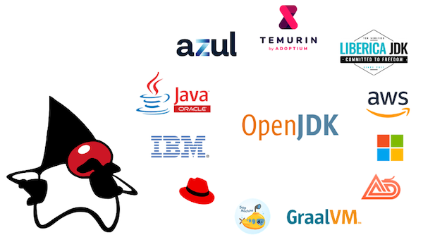

# 어떤 JDK 버전을 사용해야할까요?

> [English](/) | 한국어



Java 애플리케이션을 빌드하고 실행하려면 Java 플랫폼과 표준 스펙(Java SE)을 구현하는 Java 컴파일러, 런타임 라이브러리 및 Java 가상 머신(JVM)이 필요합니다.

[OpenJDK](https://openjdk.java.net)는 Java SE 스펙의 오픈 소스 [참조 구현](https://ko.wikipedia.org/wiki/%EC%B0%B8%EC%A1%B0_%EA%B5%AC%ED%98%84)이지만 그저 소스코드일 뿐입니다.
여러 OS와 같은 플랫폼을 지원하는 바이너리 형태의 배포판들은 각기다른 벤더(vendor)로부터 제공됩니다.
이러한 배포판들은 라이선스, 상업적 지원, 지원 플랫폼, 업데이트 주기 등이 다릅니다.

이 사이트는 독립적이면서도 주관적인 추천을 제공합니다.


## 한줄 요약

✅ 추천: [Adoptium Eclipse Temurin 21](#adoptium-eclipse-temurin)을 사용하세요. 그리고 설치된 버전이 CI 및 Production 버전이 맞는지 확인하세요.

## Releases

현재의 [JDK 릴리즈 모델](https://openjdk.java.net/projects/jdk/)에서는 6개월마다(3월과 9월) 새로운 메이저 버전 번호가 포함된 새로운 Feature 릴리즈가 계획되어있습니다. 추가로, 분기별로 버그 수정 업데이트가 있습니다.

매 2년마다 9월에 하는 릴리즈들은 LTS(Long-Term-Support) 릴리즈가 됩니다. LTS 릴리즈들은 릴리즈 이후 최소 3년간 업데이트를 받습니다.


| JDK 버전 | 릴리즈 타입 | 릴리즈 날짜 | 주요 변경 | 추천 |
|--|--|--|--|--|
| [**8**](https://openjdk.java.net/projects/jdk8/) | **LTS** | **2014년 3월** | Lambdas | 이전 릴리즈 모델의 마지막 LTS 버전. 오라클의 무료 업데이트는 [종료](https://www.oracle.com/java/technologies/java-se-support-roadmap.html)되었지만, 다른 벤더에 의해 계속 유지보수를 하고 있음. 향후 몇 달 내로 11이나 17 버전으로 업그레이드 추천! |
| [9](https://openjdk.java.net/projects/jdk9/) | Feature | 2017년 9월 | Modules | [새 릴리즈 주기가 소개됨](https://mail.openjdk.org/pipermail/discuss/2017-September/004281.html). 지원 종료(EOL). 17 혹은 21 버전으로 업그레이드 추천! |
| [10](https://openjdk.java.net/projects/jdk/10/) | Feature | 2018년 3월 | var | 지원 종료(EOL). 17 혹은 21 버전으로 업그레이드 추천! |
| [**11**](https://openjdk.java.net/projects/jdk/11/) | **LTS** | **2018년 9월** | New HTTP Client    | 지원 종료(EOL). 21 버전으로 업그레이드 추천! |
| [12](https://openjdk.java.net/projects/jdk/12/) | Feature | 2019년 3월 |                    | 지원 종료(EOL). 21 버전으로 업그레이드 추천! |
| [13](https://openjdk.java.net/projects/jdk/13/) | Feature | 2019년 9월 |                    | 지원 종료(EOL). 21 버전으로 업그레이드 추천! |
| [14](https://openjdk.java.net/projects/jdk/14/) | Feature | 2020년 3월 | Switch expressions | 지원 종료(EOL). 21 버전으로 업그레이드 추천! |
| [15](https://openjdk.java.net/projects/jdk/15/) | Feature | 2020년 9월 | Text blocks        | 지원 종료(EOL). 21 버전으로 업그레이드 추천! |
| [16](https://openjdk.java.net/projects/jdk/16/) | Feature | 2021년 3월 | Records            | 지원 종료(EOL). 21 버전으로 업그레이드 추천! |
| [**17**](https://openjdk.java.net/projects/jdk/17/) | **LTS** | **2021년 9월** | Sealed Classes | **지원되는 LTS 버전** 21 버전으로 업그레이드를 고려해보는 것 추천! |
| [18](https://openjdk.java.net/projects/jdk/18/) | Feature | 2022년 3월 | [UTF-8 by Default](https://openjdk.java.net/jeps/400) | 지원 종료(EOL). 21 버전으로 업그레이드 추천! |
| [19](https://openjdk.java.net/projects/jdk/19/) | Feature | 2022년 9월 | [미리보기](https://openjdk.org/jeps/12)와 [미완성](https://openjdk.org/jeps/11) 기능들만 추가 | 지원 종료(EOL). 21 버전으로 업그레이드 추천! |
| [20](https://openjdk.java.net/projects/jdk/20/) | Feature | 2023년 3월 | [미리보기](https://openjdk.org/jeps/12)와 [미완성](https://openjdk.org/jeps/11) 기능들만 추가 | 지원 종료(EOL). 21 버전으로 업그레이드 추천! |
| [**21**](https://openjdk.java.net/projects/jdk/21/) | **LTS** | 2023년 9월 | [Pattern Matching](https://wscp.dev/posts/tech/java-pattern-matching/), Virtual Threads | **현재의 LTS 버전** |

**(1) 최신 LTS 버전을 계속 사용할지**, 아니면 **(2) 최신 릴리즈를 사용하고 6개월마다 업그레이드할지**. 두 가지 선택지가 있습니다.
두 선택지 모두 괜찮지만, 불확실하다면 최신 LTS 버전을 사용하는 걸 추천합니다.

OpenJDK 프로젝트 자체는 [openjdk.java.net](https://openjdk.java.net)에서 관리됩니다.
[openjdk.java.net](https://openjdk.java.net)에서 스펙, 소스코드, 메일링 리스트 등을 확인할 수 있지만, 다운로드할 수 있는 빌드는 없습니다.
그렇기 때문에 **배포판(Distribution)을 선택해야합니다.**

## 배포판(Distributions)

- [Oracle의 OpenJDK 빌드 (jdk.java.net)](#oracle의-openjdk-빌드-jdkjavanet)
- [Oracle Java SE Development Kit (JDK)](#oracle-java-se-development-kit-jdk)
- [Adoptium Eclipse Temurin](#adoptium-eclipse-temurin)
- [AdoptOpenJDK](#adoptopenjdk)
- [Azul Zulu](#azul-zulu)
- [Azul Zing](#azul-zing)
- [BellSoft Liberica JDK](#bellsoft-liberica-jdk)
- [IBM Semeru 런타임](#ibm-semeru-런타임)
- [Amazon Corretto](#amazon-corretto)
- [Microsoft Build of OpenJDK](#microsoft-build-of-openjdk)
- [Alibaba Dragonwell](#alibaba-dragonwell)
- [SapMachine](#sapmachine)
- [Red Hat OpenJDK](#red-hat-openjdk)
- [GraalVM](#graalvm)


### Oracle의 OpenJDK 빌드 (jdk.java.net)

[웹사이트](https://jdk.java.net) |
[릴리즈](https://jdk.java.net) |
Docker 이미지 (n/a)

오라클은 압축된 아카이브 형식으로 Linux, macOS 및 Windows용 OpenJDK 빌드를 제공합니다.

이 빌드는 6개월 동안만 업데이트됩니다.
6개월이 지나면 업데이트 및 보안 패치가 제공되지 않습니다. 
**이는 LTS 버전에도 적용됩니다!**
예를 들어, 오라클의 OpenJDK 11 빌드 버전은 [11.0.2+9](https://jdk.java.net/archive/)이지만, 현재 OpenJDK의 버전은 [11.0.20.1+1](https://wiki.openjdk.java.net/display/JDKUpdates/JDK11u) 입니다.

⛔️ 비추: 특히 LTS 버전을 사용하실 계획이시라면 더더욱 _Oracle의 OpenJDK 빌드_ 는 사용하지 마세요.


### Oracle Java SE Development Kit (JDK)

[웹사이트](https://www.oracle.com/java/) |
[릴리즈](https://www.oracle.com/java/technologies/downloads/archive/) |
Docker 이미지 (n/a)

오라클은 OpenJDK와 완전히 동일한 소스인 오라클 Java SE Development Kit(JDK)을 기반으로 하는 상용 버전의 OpenJDK를 제공합니다.
오라클은 이 빌드들에 대해 정기적인 업데이트와 보안 패치를 제공합니다.

이 빌드들의 주요 문제는 오라클의 라이선스 정책입니다.

JDK 10 버전까지는 [오라클 바이너리 코드 라이선스 계약](https://www.oracle.com/de/downloads/licenses/binary-code-license.html)에 따라 빌드가 게시되었기 때문에 상용 프로젝트에 빌드를 사용할 수 있었습니다.

JDK 11 버전부터 16버전까지의 빌드들은 [오라클 Java SE용 오라클 기술 네트워크 라이선스 계약](https://www.oracle.com/downloads/licenses/javase-license1.html)에 따라 게시되었으며, **프로덕션 환경에서 사용하려면 유료 라이선스가 필요합니다.**
이 때문에 많은 새로운 OpenJDK 배포판이 등장했습니다.

JDK 17 버전은 _내부 비즈니스 운영_ 을 위해 사용할 수 있도록 허용하는 [오라클 무료 이용 약관(NFTC)](https://www.oracle.com/downloads/licenses/no-fee-license.html)에 따라 게시됩니다. 하지만 안타깝게도, _"내부 비즈니스 운영"_ 이라는 문구는 정의되어 있지 않으며 매우 모호한 문구입니다.(예를 들어, 외부에 공개된 웹 사이트가 내부 비즈니스 운영을 위한 것인지?)

또한, 지금까지의 이러한 불안정한 라이선스 이력을 기반으로 향후 버전 라이선스들이 어떻게 될지 예측할 수 없습니다.

⛔️ 비추: 변호사와 상담해보기 전엔 _Oracle Java SE Development Kit (JDK)_ 는 사용하지 마세요.


### Adoptium Eclipse Temurin

[웹사이트](https://adoptium.net) |
[릴리즈](https://adoptium.net/archive.html) |
[Docker 이미지](https://hub.docker.com/_/eclipse-temurin/)

Eclipse Adoptium은 오픈 소스 소프트웨어에 대한 리소스와 전문 거버넌스 모델을 제공하는 Eclipse 재단 산하의 최상위 프로젝트입니다.
Adoptium 워킹 그룹은 Red Hat, IBM, Microsoft, Azul, iJUG 등 Java 기술에 전략적 관심을 갖고 있는 주요 기업 및 조직으로 구성되어 있습니다. 이전의 AdoptOpenJDK 프로젝트는 Eclipse Adoptium으로 이전되었습니다.

프로젝트와 빌드를 구분하기 위해 Adoptium OpenJDK 빌드들은 _Eclipse Temurin_ 이라고 부릅니다.

Eclipse Temurin 빌드는 높은 퀄리티 및 벤더 중립적(vendor-neutral)이고, 허용된 라이선스에 다라 [TCK](https://en.wikipedia.org/wiki/Technology_Compatibility_Kit) 테스트를 거쳤습니다.

Adoptium은 해당 업스트림 소스가 활발하게 유지 관리되는 한 LTS 릴리즈용 바이너리를 계속 빌드할 것이라고 밝혔습니다.

✅ 추천: _Adoptium Eclipse Temurin_ OpenJDK 빌드는 강력 추천합니다.


### AdoptOpenJDK

[웹사이트](https://adoptopenjdk.net) |
[릴리즈](https://adoptopenjdk.net/archive.html?variant=openjdk11&jvmVariant=hotspot) |
[Docker 이미지](https://hub.docker.com/_/adoptopenjdk)

AdoptOpenJDK 프로젝트는 Eclipse Adoptium의 전신으로, 기본 HotSpot VM과 OpenJ9 VM 모두에 고품질 OpenJDK 빌드를 제공했습니다.

웹사이트와 이전 릴리즈는 보관된 릴리즈에 액세스할 수 있도록 온라인으로 유지됩니다.

⛔️ 비추: _AdoptOpenJDK_ 는 더이상 사용하지 마세요. 대신 _Adoptium Eclipse Temurin_ 를 사용하세요.


### Azul Zulu

[웹사이트](https://www.azul.com) |
[릴리즈](https://www.azul.com/downloads/?package=jdk#download-openjdk) |
[Docker 이미지](https://hub.docker.com/r/azul/zulu-openjdk)

Azul Systems 주식회사는 전문 Java 기술 및 JDK에 대한 상업적 지원을 전문으로 하는 회사입니다.
Azul은 업계에서 높은 명성을 얻고 있으며 Java 플랫폼의 발전을 위해 다양한 워킹 그룹에 참여하고 있습니다.

Azul은 다양한 운영 체제 및 아키텍처를 위한 _Azul Zulu_ 라는 오픈 소스 OpenJDK 빌드를 제공합니다.
또한 Azul은 JRE를 제거한 빌드, OpenJFX를 포함한 빌드 등 특수한 요구 사항을 위한 빌드도 제공합니다.

Azul Zulu의 단점은 라이선스 또는 업데이트 정책을 갑자기 변경할 수 있는 단일 회사에 종속된다는 것입니다.

✅ 추천: _OpenJDK의 Azul Zulu 빌드_ 는 좋은 선택입니다.


### Azul Zing

[웹사이트](https://www.azul.com) |
[릴리즈](https://www.azul.com/products/prime/stream-download/) |
[Docker 이미지](https://hub.docker.com/u/azul)

Azul Zing은 OpenJDK의 상업적으로 최적화된 빌드입니다. 현재 _Azul Platform Prime_ 으로 판매되고 있습니다.
무료로 평가(Evaluation) 가능하지만, 프로덕션용으로 사용하려면 Azul Systems 주식회사와 상용 계약이 필요합니다.

Zing은 OpenJDK를 기반으로 몇 가지 주요 구성 요소를 최적화된 버전으로 대체합니다.

- `C4 무중단 Garbage Collector` - Java 8 및 11을 포함한 모든 주요 Java 버전에서 사용가능한 유일한 세대별, 프로덕션 테스트를 거친 가비지 컬렉터
- `Falcon JIT(Just-In-Time) 컴파일러`- 더 빠른 처리량, 더 낮은 응답 레이턴시, 더 큰 전송 용량을 위한 최적화
- `ReadyNow 웜업 옵티마이저` - 애플리케이션의 기존 실행들을 통해 학습하여 애플리케이션을 최대한 빠르게 최대 속도로 최적화
- `Azul 옵티마이저 허브` - 클라이언트 머신에서 JIT 컴파일을 오프로드하고 JVM이 서로 학습하여 가능한 한 빨리 최대 속도에 도달할 수 있도록 하는 별도 컴포넌트

Azul Zing은 지연시간에 민감한 애플리케이션에 좋은 선택입니다.
평균 지연시간이 낮고, 최소 지연시간 이상값을 보장해야하거나 공격적으로 확장 및 축소가 가능하고 가능한 한 빨리 트래픽을 처리해야하는 경우, 인프라 비용이 문제가 되는 애플리케이션을 실행하는 대규모 JVM에 적합합니다.

⚠️ 추천: GC 중단시간, Warmup이 느린 경우, 대규모 온프레미스 인프라 및 클라우드 비용이 문제가 된다면 _Azul Zing / Azul Platform Prime_ 을 고려해보세요. 라이선스 없이 프로덕션에서 사용하지 마세요.


### BellSoft Liberica JDK

[웹사이트](https://bell-sw.com) |
[릴리즈](https://bell-sw.com/pages/downloads/?) |
[Docker 이미지](https://hub.docker.com/u/bellsoft)

Azul과 마찬가지로 BellSoft는 전문 Java 기술 및 JDK에 대한 상업적 지원을 전문으로 합니다.
또한 업계에서 높은 평판을 얻고 있으며 Java 플랫폼의 발전을 위해 다양한 워킹 그룹에 참여하고 있습니다.

BellSoft는 거의 모든 운영 체제 및 아키텍처를 위한 _Liberica JDK_ 라는 오픈 소스 OpenJDK 빌드를 제공합니다.

널리 사용되는 Spring Boot 프레임워크는 [빌드팩](https://github.com/paketo-buildpacks/bellsoft-liberica)의 런타임으로 Liberica JDK를 선택했습니다.

BellSoft Liberica JDK의 단점은 라이선스 또는 업데이트 정책을 갑자기 변경할 수 있는 단일 회사에 종속된다는 것입니다.

✅ 추천: _BellSoft Liberica JDK_ 는 좋은 선택입니다.


### IBM Semeru 런타임

[웹사이트](https://developer.ibm.com/languages/java/semeru-runtimes/) |
[릴리즈](https://developer.ibm.com/languages/java/semeru-runtimes/downloads/) |
Docker 이미지 (n/a)

IBM은 J9라는 자체 버전의 JVM을 개발했으며, 이 JVM은 _Eclipse OpenJ9_ 로 오픈 소스화되었습니다.
기본 HotSpot JVM의 대안이지만 큰 인기를 얻지는 못했습니다.

IBM은 현재 이클립스 OpenJ9 JVM과 일부 OpenJDK 클래스 라이브러리를 기반으로 하는 _Semeru Runtime_ 이라는 빌드를 제공합니다.
OpenJ9은 [메모리 사용량이 적고 공유 클래스로 빠르게 시작할 수 있지만](https://www.eclipse.org/openj9/performance/), 핫스팟 가상 머신에 비해 처리량이 낮습니다.

⚠️ 추천: OpenJ9 가상 머신이 필요하다는 것을 알고 있는 경우에만 _IBM Semeru 런타임_ 을 사용하세요.


### Amazon Corretto

[웹사이트](https://aws.amazon.com/corretto/) |
[릴리즈](https://aws.amazon.com/corretto/) |
[Docker 이미지](https://hub.docker.com/_/amazoncorretto)

오라클이 OpenJDK 빌드에 대한 지원 및 라이선스 정책을 변경한 이후, 주요 클라우드 제공업체는 자체적으로 관리형 OpenJDK 빌드를 구축하고 장기 업데이트를 제공하기로 결정했습니다. 이는 위험, 특히 오라클과의 소송을 피하기 위한 것으로 보입니다.

2018년에 AWS는 또 다른 OpenJDK 빌드인 _Corretto_ 를 발표했습니다.

AWS는 최신 OpenJDK 버전의 버그 수정 백포트를 포함하며, [주장](https://aws.amazon.com/corretto/faqs/)에 따르면 아직 OpenJDK 프로젝트에 통합되지 않은 패치를 추가할 것이라고 합니다. 아마존은 자사 서비스에 최적화된 대체 [암호화 공급자](https://github.com/corretto/amazon-corretto-crypto-provider)를 구현했습니다. Corretto에서 기본 암호화 구현으로 사용될 [예정](https://aws.amazon.com/blogs/opensource/introducing-amazon-corretto-crypto-provider-accp/)입니다.

아마존은 주요 개발 플랫폼용 릴리즈와 자체 아마존 리눅스 2에 최적화된 버전을 제공합니다.

✅ 추천: 특히 AWS의 Amazon Linux 2에서 Java 애플리케이션을 직접 실행하는 경우, _Corretto_ 빌드가 좋은 선택입니다.


### Microsoft Build of OpenJDK

[웹사이트](https://www.microsoft.com/openjdk) |
[릴리즈](https://docs.microsoft.com/en-us/java/openjdk/download) |
[Docker 이미지](https://docs.microsoft.com/en-us/java/openjdk/containers)

2021년에 Microsoft는 또 다른 OpenJDK 빌드인 _Microsoft Build of OpenJDK_ 를 발표했습니다.

Microsoft는 이 빌드에 최신 OpenJDK 버전의 버그 수정 백포트를 포함할 수 있으며, 아직 OpenJDK 프로젝트에 통합되지 않은 패치를 추가할 수 있다고 주장합니다.

Microsoft는 주요 개발 플랫폼에 대한 릴리즈를 제공합니다.

⚠️ 추천: Azure에서 직접 Java 애플리케이션을 실행하는 경우에만 _Microsoft 빌드 of OpenJDK_ 를 사용하세요. 더 다양한 선택지가 있습니다.

### Alibaba Dragonwell

[웹사이트](http://dragonwell-jdk.io) |
[릴리즈](http://dragonwell-jdk.io) |
[Docker 이미지](https://github.com/alibaba/dragonwell11/wiki/Use-Dragonwell-11-docker-images)

Alibaba는 백 포트와 일부 _추가 기능_ 이 포함된 OpenJDK 빌드를 제공합니다.

⛔️ 비추: 정부에서 강제하지 않는 한 _Alibaba Dragonwell_ 는 사용하지 마세요.


### SapMachine

[웹사이트](https://sap.github.io/SapMachine/) |
[릴리즈](https://github.com/SAP/SapMachine/releases) |
[Docker 이미지](https://hub.docker.com/_/sapmachine)

SapMachine은 SAP에서 유지 관리하는 또 다른 OpenJDK 빌드입니다.

⚠️ 추천: SAP 서버에서 Java 애플리케이션을 실행하는 경우에만 _SapMachine_ 을 사용하세요. 더 다양한 선택지가 있습니다.


### Red Hat OpenJDK

[웹사이트](https://developers.redhat.com/products/openjdk/overview) |
[릴리즈](https://developers.redhat.com/products/openjdk/download) |
[Docker 이미지](https://catalog.redhat.com/software/containers/ubi8/openjdk-11/5dd6a4b45a13461646f677f4)

Red Hat은 LTS 버전용 OpenJDK 빌드를 제공합니다.

⚠️ 추천: Red Hat Enterprise Linux에서 Java 애플리케이션을 직접 실행하는 경우에만 _Red Hat OpenJDK_ 를 사용하십시오. 더 다양한 선택지가 있습니다.


### ojdkbuild

[웹사이트](https://github.com/ojdkbuild/ojdkbuild) |
[릴리즈](https://github.com/ojdkbuild/ojdkbuild/releases  ) |
Docker 이미지 (n/a)

이 프로젝트는 중단되었습니다.
ojdkbuild 프로젝트의 목표는 zlib 또는 OpenSSL의 패키지 버전 대신 시스템 라이브러리를 사용하는 등 가능한 한 Linux OpenJDK 패키지에 가까운 동작을 하는 Windows x86_64 OpenJDK 바이너리를 제공하려는 것이었습니다.
ojdkbuild는 CentOS에 포함된 패키지를 사용했습니다.
Windows 시스템에서 Java 소프트웨어를 개발하여 프로덕션 환경의 Linux 서버에 배포하기 위해 사용했습니다.

⛔️ 비추: 프로젝트가 중단되었으므로 _ojdkbuild_ 를 사용하지 마세요.


### GraalVM

[웹사이트](https://www.graalvm.org) |
[릴리즈](https://github.com/graalvm/graalvm-ce-builds/releases) |
[Docker 이미지](https://github.com/graalvm/container/pkgs/container/graalvm-ce)

GraalVM은 완벽하게 호환되는 JDK이지만 다른 모든 빌드와는 많이 다릅니다.

GraalVM은 오라클에서 개발했습니다. 
OpenJDK를 기반으로 하지만 새로운 고성능 컴파일러와 새로운 다국어(polyglot) 가상 머신(다양한 프로그래밍 언어로 작성된 코드를 실행할 수 있음)이 포함되어 있습니다.
또한 고도로 최적화되고 극도로 빠르게 시작되는 플랫폼별 네이티브 실행 파일을 생성할 수도 있습니다.

🤷 검증된 추천 의견을 정교화할 수 있도록 프로덕션 환경에서 GraalVM을 사용한 경험을 [공유](https://github.com/whichjdk/whichjdk.com/issues/6)해 주세요.


## 특이 케이스

### 애플 실리콘

_macOS/AArch64_ 에 대한 공식 지원은 OpenJDK 17 릴리즈의 [JEP 391](https://openjdk.java.net/jeps/391)에서 구현되었습니다.

macOS _x64_ 빌드는 Rosetta 2에서 안정적으로 실행되지만 에뮬레이션으로 인해 성능이 크게 저하될 수 있습니다.
저처럼 _Apple Silicon_ Mac에서 개발하는 사람은 네이티브 macOS _AArch64_(일명 _ARM 64_) 빌드의 JDK를 설치해야 합니다.

대부분의 배포판에는 Java 17+ 전용 _macOS/AArch64_ 빌드가 있습니다.
[BellSoft Liberica](https://bell-sw.com/announcements/2021/03/12/Liberica-on-Apple-Silicon/) 및 [Azul Zulu](https://www.azul.com/newsroom/azul-announces-support-of-java-builds-of-openjdk-for-apple-silicon/)는 Java 8 및 Java 11용 _macOS/AArch64_ 빌드도 무료로 제공합니다.


## 자주 묻는 질문

### 로컬 환경에서 JDK를 설치하는 가장 좋은 방법은 무엇인가요?

[SDKMAN](https://sdkman.io/install)을 사용하세요!

사용가능한 JDK 목록을 보고싶다면:
```bash
sdk list java
```

특정 버전을 설치하고 싶다면:
```
sdk install 17.0.8.1-tem
```

버전을 확인하고 싶다면:
```
java --version
```


### 현재 어떤 버전의 Java가 설치되어 있는지 알고 싶어요

```
which java
`which java` --version
```

리눅스 환경이라면:
```
sudo update-java-alternatives
```

### JDK와 JRE의 차이점은 무엇인가요?

일부 배포판은 JDK(Java Development Kit)와 JRE(Java Runtime Environment) 빌드를 제공합니다.
JDK에는 Java 애플리케이션을 _컴파일, 패키징 및 실행_ 하기 위한 모든 것이 포함되어 있는 반면, JRE에는 Java 애플리케이션을 _실행_ 하기 위한 바이너리와 라이브러리만 포함되어 있습니다.
JRE는 JDK의 축소 버전으로, 메가바이트 단위로 더 작습니다.

크기가 중요한 경우 [jlink](https://blog.adoptium.net/2021/10/jlink-to-produce-own-runtime/)를 사용하여 자체적으로 축소된 런타임을 생성하는 것을 고려하세요.

로컬 환경 개발에는 JDK가 필요합니다.
프로덕션 환경에서는 런타임 환경만 필요하지만 JDK를 사용하는 경우도 매우 일반적입니다.

### Java EE가 무엇인가요?

_Java EE (Java Platform, Enterprise Edition)_ 는 _Jakarta EE_ 로 이름을 변경했습니다.
Jakarta EE는 서버 애플리케이션과 프론트엔드를 구축하기 위한 스펙입니다.
범위면에서, Jakarta EE는 [Spring Boot](https://spring.io/projects/spring-boot), [Micronaut](https://micronaut.io), [Quarkus](https://quarkus.io)와 같은 최신 프레임워크와 비교할 수 있지만, Jakarta EE가 더 복잡하게 느껴집니다.

⚠️ 추천: _자카르타 EE_ 를 기반으로 새 프로젝트를 시작하지 마세요. 대부분의 사람들이 _Spring Boot_ 를 사용하는데, 이는 좋은 선택입니다. Java EE에 대한 배경 지식이 풍부하다면 _Quarkus_ 를 고려해 보세요. Groovy와 Grails를 좋아한다면 _Micronaut_ 을 고려해 보세요.


## 이 웹사이트에 대해서

이 웹사이트는 [Jochen Christ](https://twitter.com/jochen_christ)가 관리하고 있습니다.
이 사이트에 제시된 모든 추천이나 의견은 개인적인 것이며 오랜 전문적 경험을 바탕으로 한 것입니다.
저자는 여기에 언급된 어떤 조직과도 관련이 없습니다.

오타나 잘못된 내용을 발견하셨다면, [이슈를 생성](https://github.com/whichjdk/whichjdk.com/issues/new)해주시거나 [Pull Request를 생성](https://github.com/whichjdk/whichjdk.com/pulls)해주세요.

Java 및 OpenJDK는 Oracle 및/또는 그 계열사의 상표 또는 등록 상표입니다.

*한국어 번역 : @MinJunKweon*
